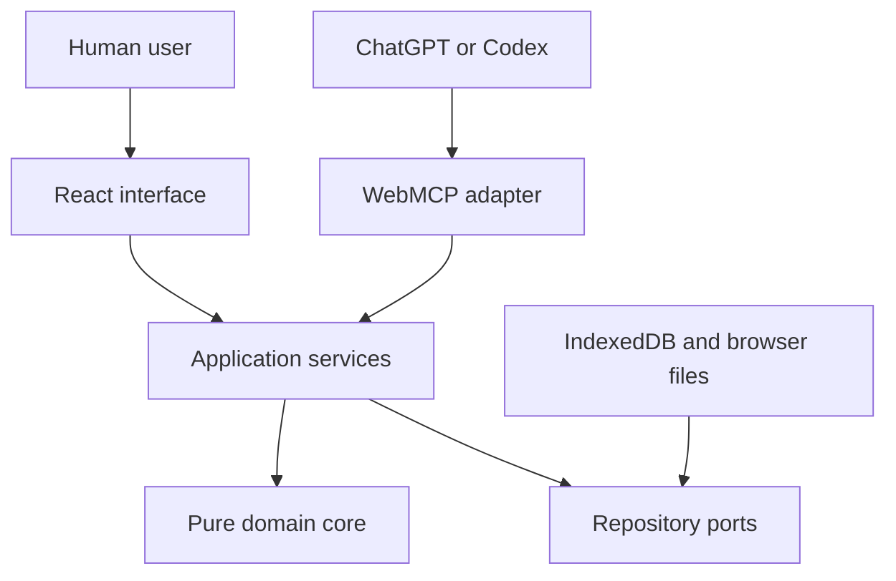

# FlowSurgeon Architecture Specification

**Tagline:** Redesign the work before automating it.  
**Document status:** Approved architecture baseline  
**Document language:** English  
**Target:** OpenAI WebMCP Challenge 2026  
**Submission deadline:** September 3, 2026 at 1:00 PM PDT  
**Spain deadline equivalent:** September 3, 2026 at 10:00 PM CEST  
**Internal submission cutoff:** September 3, 2026 at 6:00 PM CEST  
**Architecture:** Local-first client-side modular monolith  
**Primary deployment:** Vercel  
**License:** MIT

---

## 1. Purpose

This document is the normative product and technical specification for FlowSurgeon. It is intended to be handed directly to Codex before implementation planning. It defines the product scope, architecture, domain model, WebMCP tools, human-control boundary, user experience, security controls, tests, evaluation criteria, deployment requirements, and hackathon demonstration.

The implementation must not reinterpret or silently expand this specification. When a requirement is not explicitly included, the default is to exclude it from the hackathon MVP.

Normative terms are used as follows:

- **MUST**: mandatory for the hackathon submission.
- **MUST NOT**: prohibited.
- **SHOULD**: expected unless a verified technical constraint prevents it.
- **MAY**: optional and lower priority.

All source code, identifiers, comments, documentation, interface copy, accessibility text, error messages, tests, fixtures, commit messages, pull request descriptions, Devpost materials, screenshots, and video narration MUST be written in English.

---

## 2. Product thesis

Organizations often automate processes before verifying that every step should still exist. Automation can make a good workflow faster, but it can also make waste run faster.

FlowSurgeon is a human-in-the-loop process redesign canvas where a person and a browser agent inspect, challenge, and improve the same live workflow. The human defines the process, context, and protected constraints. ChatGPT or Codex reads and analyzes the process through WebMCP, focuses relevant elements on the shared canvas, and prepares a structured change proposal. The human reviews every operation and remains the only actor allowed to apply the final changes.

FlowSurgeon is not a chatbot, generic diagram editor, BPMN suite, automation executor, or embedded AI wrapper. It is a shared visual decision environment with a structured agent interface.

### 2.1 One-sentence description

> FlowSurgeon lets people and AI agents redesign workflows together while keeping final approval exclusively human.

### 2.2 Core value

- The agent reads an exact structured process instead of guessing from pixels.
- Recommendations include evidence, affected elements, and measurable impact.
- Agent changes are proposals, never silent mutations.
- Protected business controls are enforced in the domain layer.
- Every applied proposal is versioned and reversible.
- The application remains fully usable without WebMCP.

---

## 3. Target users

FlowSurgeon is intentionally general-purpose. It must use plain process language rather than requiring BPMN knowledge.

Primary user types:

| User | Primary need |
|---|---|
| Process owner | Improve a workflow they are responsible for |
| Consultant or analyst | Diagnose client workflows and explain improvements |
| Operations manager | Reduce delays, costs, handoffs, and duplicate work |
| Small-business owner | Document and simplify recurring operations |
| Project manager | Clarify responsibilities, dependencies, and decisions |
| Individual professional | Improve a personal recurring workflow |

The product is general-purpose, but the official demonstration MUST use a concrete purchase-request approval process.

---

## 4. Product principles

### 4.1 Shared visual truth

The human interface and WebMCP tools MUST operate on the same active `ProcessDocument`. The agent MUST NOT maintain a hidden alternative representation.

### 4.2 Propose, never silently mutate

An agent MAY create and revise pending `ChangeSet` records. It MUST NOT approve, apply, reject, import, export, delete, protect, unprotect, or restore process state.

### 4.3 Human-only approval

Final approval and application MUST exist only as human interface commands. No WebMCP tool, URL parameter, hidden DOM action, or indirect tool composition may expose this authority.

### 4.4 Evidence before recommendation

Every finding or proposed operation MUST identify the affected elements, rationale, relevant evidence, and expected impact.

### 4.5 Reversibility

Applying a proposal MUST create an immutable version snapshot. The user MUST be able to compare and restore versions through the interface.

### 4.6 Protected constraints

The user MAY protect a step. WebMCP tools MUST NOT change protection state. A protected step and its incident connections MUST be immutable to agent-authored proposals.

### 4.7 Local-first privacy

Processes MUST be stored in IndexedDB. The MVP MUST NOT require accounts, remote storage, telemetry, analytics, or a backend.

### 4.8 Manual parity and graceful degradation

The normal interface MUST remain usable when `document.modelContext` is unavailable. Every agent capability MUST have a human equivalent except capabilities intentionally restricted to humans.

---

## 5. MVP scope

### 5.1 Required capabilities

The MVP MUST include:

- A local process catalog.
- Create, rename, duplicate, open, and delete-with-confirmation operations.
- Three seeded templates.
- A visual left-to-right process canvas.
- Step and connection creation, editing, movement, and deletion.
- Step protection controlled by humans.
- Undo and redo for manual editing.
- Deterministic validation and metrics.
- Structured findings.
- Seven WebMCP tools.
- Visual focusing initiated by the agent.
- Structured agent-authored proposals.
- Simulation before review.
- Per-operation human accept/reject decisions.
- Dependency-aware partial acceptance.
- Human-only final application.
- Immutable version snapshots.
- Before/after comparison.
- JSON import and export.
- Persistent local data.
- Accessible process outline.
- A public static deployment and public source repository.

### 5.2 Seeded templates

The application MUST include:

1. `Purchase Request Approval`
2. `Customer Support Escalation`
3. `Content Review and Publishing`

Each template MUST include intentional inefficiencies, complete metric fields, at least one decision, at least one wait or handoff, and at least one protected step.

### 5.3 Explicit non-goals

The MVP MUST NOT include:

- User accounts or authentication.
- Remote database or cloud synchronization.
- Multi-user collaboration.
- Embedded chat or OpenAI API calls.
- External ERP, CRM, CMS, or automation integrations.
- BPMN compatibility.
- Native mobile applications.
- Payments or subscriptions.
- Execution of real-world automations.
- Predictive analytics.
- Agent-accessible destructive or approval operations.
- Internationalization.
- A marketplace.

---

## 6. Critical user journey

1. The user opens the public site.
2. The user opens the `Purchase Request Approval` template.
3. The application displays the workflow, metrics, and protected compliance control.
4. The user asks ChatGPT or Codex:

   > Analyse this workflow. Reduce waiting time and duplicate work, preserve the protected compliance control, and prepare a proposal for my review.

5. The agent calls read and analysis tools.
6. The agent focuses affected steps on the live canvas.
7. The agent creates a pending proposal.
8. FlowSurgeon opens the proposal review panel.
9. The user rejects at least one operation and accepts the others.
10. The user applies accepted changes from the visible interface.
11. FlowSurgeon creates a new immutable version.
12. The user sees before/after metrics and can restore the previous version.

The complete journey MUST fit inside a public demonstration video shorter than three minutes.

---

## 7. Architecture style

FlowSurgeon MUST be implemented as a client-side modular monolith with inward-pointing dependencies:



### 7.1 Dependency rule

- The domain MUST NOT import React, WebMCP, Dexie, IndexedDB, browser globals, or React Flow.
- Application services MAY depend on domain types and repository ports.
- Infrastructure MUST implement application ports.
- Presentation and WebMCP adapters MUST call application services.
- React components MUST NOT access IndexedDB directly.
- WebMCP execute handlers MUST NOT contain domain rules.

### 7.2 Composition root

`src/app/compositionRoot.ts` MUST explicitly create and connect the database, repositories, services, stores, and WebMCP adapter. A generic dependency-injection container MUST NOT be added.

---

## 8. Technology stack

| Concern | Required technology |
|---|---|
| Language | TypeScript with strict mode |
| UI | React 19.x |
| Build | Vite |
| Canvas | `@xyflow/react` |
| Client state | Zustand |
| Runtime validation | Zod |
| Persistence | Dexie over IndexedDB |
| Accessible primitives | Radix UI where appropriate |
| Styling | CSS Modules and CSS custom properties |
| WebMCP types | `webmcp-types` |
| Unit tests | Vitest |
| Component tests | React Testing Library |
| Property tests | `fast-check` |
| IndexedDB tests | `fake-indexeddb` |
| End-to-end tests | Playwright |
| Accessibility tests | axe-core |
| CI | GitHub Actions |

The project MUST NOT depend on the OpenAI SDK or require an API key.

---

## 9. Repository structure

```text
flowsurgeon/
├── .github/
│   ├── dependabot.yml
│   └── workflows/
│       ├── ci.yml
│       └── dependency-review.yml
├── docs/
│   ├── architecture/
│   │   ├── architecture.md
│   │   ├── data-model.md
│   │   ├── webmcp-tools.md
│   │   └── security.md
│   ├── decisions/
│   │   ├── 0001-local-first.md
│   │   ├── 0002-human-only-approval.md
│   │   └── 0003-semantic-changesets.md
│   ├── demo/demo-script.md
│   ├── evals/webmcp-eval-results.md
│   └── submission/
│       ├── ASSET_PROVENANCE.md
│       ├── CHALLENGE_TIMELINE.md
│       ├── DEVPOST_SUBMISSION.md
│       ├── SUBMISSION_CHECKLIST.md
│       └── TESTING_INSTRUCTIONS.md
├── public/
│   ├── icons/
│   └── manifest.webmanifest
├── src/
│   ├── app/
│   │   ├── App.tsx
│   │   ├── compositionRoot.ts
│   │   ├── routes.tsx
│   │   └── providers/
│   ├── domain/
│   │   ├── process/
│   │   ├── analysis/
│   │   ├── proposals/
│   │   └── versions/
│   ├── application/
│   │   ├── ports/
│   │   └── services/
│   ├── infrastructure/
│   │   ├── database/
│   │   ├── files/
│   │   └── browser/
│   ├── adapters/
│   │   ├── ui/
│   │   └── webmcp/
│   ├── presentation/
│   │   ├── pages/
│   │   ├── canvas/
│   │   ├── catalog/
│   │   ├── inspector/
│   │   ├── analysis/
│   │   ├── proposals/
│   │   ├── versions/
│   │   ├── onboarding/
│   │   └── shared/
│   ├── state/
│   ├── examples/
│   └── styles/
├── tests/
│   ├── unit/
│   ├── integration/
│   ├── webmcp/
│   ├── fixtures/
│   └── e2e/
├── AGENTS.md
├── CONTRIBUTING.md
├── LICENSE
├── README.md
├── THIRD_PARTY_NOTICES.md
├── package.json
├── tsconfig.json
├── vite.config.ts
└── vercel.json
```

`AGENTS.md` MUST state the English-only policy, dependency rules, human-only approval rule, required verification commands, and prohibited shortcuts.

---

## 10. Domain model

### 10.1 Process document

```ts
interface ProcessDocument {
  schemaVersion: 1;
  id: string;
  revision: number;
  name: string;
  description: string;
  objective?: string;
  assumptions: string[];
  settings: ProcessSettings;
  steps: ProcessStep[];
  connections: ProcessConnection[];
  layout: ProcessLayout;
  createdAt: string;
  updatedAt: string;
}

interface ProcessSettings {
  currency: string;
  durationUnit: "minutes";
  cycleTimeStrategy: "longest_path";
  costStrategy: "sum_all_steps";
}
```

All timestamps MUST be ISO 8601 UTC strings. IDs MUST be created with `crypto.randomUUID()`. Durations MUST be stored as non-negative minutes.

### 10.2 Steps

```ts
type ProcessStepType =
  | "start"
  | "task"
  | "decision"
  | "wait"
  | "handoff"
  | "automation"
  | "end";

type RiskLevel = "none" | "low" | "medium" | "high" | "critical";
type AutomationPotential = "none" | "low" | "medium" | "high";

interface ProcessStep {
  id: string;
  type: ProcessStepType;
  title: string;
  description: string;
  owner?: string;
  system?: string;
  activeDurationMinutes: number;
  waitingDurationMinutes: number;
  estimatedCost: number;
  riskLevel: RiskLevel;
  automationPotential: AutomationPotential;
  protected: boolean;
  protectionReason?: string;
  tags: string[];
  notes?: string;
  position: { x: number; y: number };
  createdAt: string;
  updatedAt: string;
}
```

Rules:

- A start step MUST NOT have incoming connections.
- An end step MUST NOT have outgoing connections.
- A decision SHOULD have at least two outgoing connections.
- Negative duration or cost MUST be rejected.
- A protected step MUST include a protection reason.
- Agent proposals MUST NOT modify a protected step or its incident connections.
- Agent proposal schemas MUST NOT include the `protected` property.
- Titles MUST contain 1–120 characters.
- Descriptions and notes MUST contain at most 2,000 characters each.
- A step MUST contain at most 20 tags of at most 40 characters each.

### 10.3 Connections

```ts
interface ProcessConnection {
  id: string;
  sourceStepId: string;
  targetStepId: string;
  label?: string;
  condition?: string;
  order: number;
  createdAt: string;
  updatedAt: string;
}
```

Connections MUST reference existing steps, MUST NOT connect a step to itself, and MUST NOT duplicate the same source-target pair and condition.

### 10.4 Layout

The MVP MUST use a left-to-right canvas. Layout position is persisted, but analysis MUST derive process order from connections, not coordinates.

---

## 11. Validation and analysis

### 11.1 Validation issue

```ts
interface ValidationIssue {
  id: string;
  ruleId: string;
  severity: "info" | "warning" | "error";
  title: string;
  message: string;
  affectedElementIds: string[];
  evidence: Record<string, unknown>;
  suggestedAction?: string;
}
```

Required rules:

```text
PROCESS_MISSING_START
PROCESS_MISSING_END
MULTIPLE_START_STEPS
DISCONNECTED_STEP
UNREACHABLE_STEP
DANGLING_CONNECTION
DUPLICATE_CONNECTION
SELF_CONNECTION
DECISION_WITHOUT_BRANCHES
DECISION_BRANCH_WITHOUT_CONDITION
UNINTENDED_CYCLE
MISSING_STEP_TITLE
MISSING_OWNER
NEGATIVE_DURATION
NEGATIVE_COST
EXCESSIVE_WAITING_TIME
EXCESSIVE_HANDOFFS
PROTECTED_STEP_WITHOUT_REASON
```

### 11.2 Metrics

```ts
interface ProcessMetrics {
  processRevision: number;
  totalSteps: number;
  taskSteps: number;
  decisionSteps: number;
  waitSteps: number;
  handoffSteps: number;
  manualSteps: number;
  automatedSteps: number;
  protectedSteps: number;
  totalActiveMinutes: number;
  totalWaitingMinutes: number;
  totalEffortMinutes: number;
  estimatedCycleTimeMinutes: number | null;
  estimatedCostPerRun: number;
  handoffCount: number;
  automationCoveragePercent: number;
  waitingTimePercent: number;
  validationIssueCount: number;
  criticalPathStepIds: string[];
  calculationWarnings: MetricWarning[];
}
```

Calculations MUST be deterministic:

- `totalActiveMinutes`: sum of all active durations.
- `totalWaitingMinutes`: sum of all waiting durations.
- `totalEffortMinutes`: active plus waiting duration across all steps.
- `estimatedCycleTimeMinutes`: longest path through an acyclic graph.
- `estimatedCostPerRun`: sum of all step costs.
- `automationCoveragePercent`: automated executable steps divided by all executable steps.
- `waitingTimePercent`: waiting time divided by total effort.
- `handoffCount`: owner changes across connected executable steps.

When a cycle prevents critical-path calculation, cycle time MUST be `null` and the engine MUST emit `CYCLE_TIME_UNAVAILABLE`. Other metrics MUST remain available.

### 11.3 Findings

Findings MUST identify category, severity, affected elements, evidence, explanation, suggested direction, confidence, and optional impact. Required categories are structure, waiting, handoffs, duplication, ownership, automation, risk, and cost. Heuristic findings MUST be labeled as heuristic rather than deterministic.

---

## 12. Change proposals

### 12.1 ChangeSet

```ts
type ChangeSetStatus =
  | "draft"
  | "ready_for_review"
  | "partially_reviewed"
  | "approved"
  | "rejected"
  | "stale"
  | "applied"
  | "archived";

interface ChangeSet {
  id: string;
  processId: string;
  baseRevision: number;
  title: string;
  summary: string;
  rationale: string;
  status: ChangeSetStatus;
  operations: ChangeOperation[];
  reviews: OperationReview[];
  simulation: ChangeSetSimulation;
  createdBy: "agent" | "human";
  createdAt: string;
  updatedAt: string;
  reviewedAt?: string;
  appliedAt?: string;
}
```

Supported semantic operations:

```text
add_step
update_step
remove_step
move_step
add_connection
update_connection
remove_connection
```

Every operation MUST include `operationId`, `rationale`, optional `expectedImpact`, and a `dependsOn` list. A generic document patch operation MUST NOT be used.

### 12.2 Human review

```ts
interface OperationReview {
  operationId: string;
  decision: "pending" | "accepted" | "rejected";
  humanNote?: string;
  reviewedAt?: string;
}
```

The UI MUST prevent final application until every operation has a decision. Rejecting an operation MUST reject or invalidate dependent operations. The application MUST never apply an invalid subset.

### 12.3 Stale proposals

Before application:

```text
proposal.baseRevision === process.revision
```

If false, the proposal MUST be marked stale and MUST NOT be applied. The agent may revise it only after reading the current process.

### 12.4 Atomic application

Application MUST occur inside one Dexie transaction:

1. Recheck revision.
2. Recheck protected constraints.
3. Resolve accepted-operation dependencies.
4. Simulate the accepted subset.
5. Recalculate validation and metrics.
6. Store the previous immutable version.
7. Store the new process snapshot.
8. Mark the proposal applied.
9. Commit.

Any failure MUST roll back the complete transaction.

---

## 13. Application services

### 13.1 ProcessCatalogService

Lists, creates, renames, duplicates, deletes with confirmation, opens, and seeds processes.

### 13.2 ProcessCommandService

Handles manual step and connection commands, metadata changes, protection state, undo, and redo.

### 13.3 ProcessQueryService

Returns the active process, overview, elements, graph subsets, protected elements, metrics, and history without side effects.

### 13.4 AnalysisService

Runs structural validation, metrics, deterministic findings, and version comparison.

### 13.5 ProposalService

Creates, validates, simulates, revises, reviews, applies, rejects, archives, and marks proposals stale. The apply method MUST be reachable only from the UI adapter.

### 13.6 VersionService

Creates, lists, compares, and restores immutable snapshots.

### 13.7 ImportExportService

Performs canonical JSON export, strict import validation, compatible migrations, safe filenames, and round-trip verification.

---

## 14. State management

State MUST be separated into:

1. **Persistent domain state:** processes, proposals, versions, preferences.
2. **Loaded application state:** active process, metrics, findings, pending proposal, persistence status.
3. **Ephemeral UI state:** selection, viewport, open panel, modal, drag, hover, and notifications.

React Flow MUST NOT be the source of truth. It MUST render nodes and edges derived from the active `ProcessDocument`.

Manual drag updates SHOULD be rendered immediately and persisted on drag end. Text edits SHOULD use a short debounce. A visible status MUST indicate `Saving`, `Saved`, or an error.

---

## 15. Persistence

Dexie MUST define four stores:

### 15.1 processes

```text
id, name, description, schemaVersion, revision,
currentSnapshot, createdAt, updatedAt, lastOpenedAt
```

### 15.2 proposals

```text
id, processId, baseRevision, status, title, summary,
operations, reviews, simulation, createdAt, updatedAt
```

### 15.3 versions

```text
id, processId, revision, snapshot, metrics, source,
sourceProposalId, label, createdAt
```

### 15.4 settings

```text
key, value, updatedAt
```

Migration failure MUST NOT delete the database. The application MUST present a recovery state and preserve any readable data.

If IndexedDB is unavailable, FlowSurgeon MUST fall back to an in-memory repository, display a persistent warning, and allow export. It MUST NOT claim that data will survive reload.

---

## 16. WebMCP implementation strategy

FlowSurgeon MUST use the imperative API on `document.modelContext`. It MUST NOT use `navigator.modelContext`, declarative form tools, or iframe-registered tools.

Tools MUST be registered once after database initialization, sample seeding, service composition, and UI mount. Execute handlers MUST resolve the active process at call time. No tool may enumerate inactive local processes.

Every execute handler MUST accept the WebMCP execution context as its second argument, extract its `AbortSignal`, and stop safely when cancellation is requested. Long-running calculations and asynchronous persistence calls MUST check `signal.aborted` at deterministic boundaries. Cancellation MUST return or throw the platform-supported cancellation outcome without committing partial state, opening an error toast, or reporting success.

Each tool MUST:

- Have one clear purpose.
- Use a strict JSON Schema with `additionalProperties: false`.
- Validate inputs again with Zod.
- Return JSON-serializable structured results.
- Include active process ID and revision.
- Update the visible interface after effects.
- Return recoverable errors that let an agent self-correct.
- Respect cancellation through `AbortSignal` and preserve atomicity.
- Keep descriptions below 500 characters.
- Keep parameter descriptions below 150 characters.
- Keep normal output below approximately 1,500 characters.

### 16.1 Common result envelope

```ts
interface ToolSuccess<T> {
  ok: true;
  tool: string;
  processId: string;
  processRevision: number;
  timestamp: string;
  data: T;
}

interface ToolFailure {
  ok: false;
  tool: string;
  processId?: string;
  processRevision?: number;
  timestamp: string;
  error: {
    code: string;
    message: string;
    recoverable: boolean;
    suggestedAction?: string;
    details?: Record<string, unknown>;
  };
}
```

### 16.2 Required tools

#### get_process_overview

- Read-only.
- Input: empty object.
- Returns metadata, revision, counts, protected step IDs, metric summary, and pending proposal count.
- Annotations: `readOnlyHint: true`, `untrustedContentHint: true`.

#### get_process_elements

- Read-only.
- Inputs: `elementType`, optional IDs, optional step types, `protectedOnly`, cursor, and limit 1–25.
- Returns paginated steps or connections.
- A cursor MUST be revision-bound and fail with `CURSOR_REVISION_MISMATCH` after edits.
- Annotations: `readOnlyHint: true`, `untrustedContentHint: true`.

#### analyze_process

- Read-only with a visible analysis-panel update.
- Inputs: optional categories, severities, and finding limit 1–20.
- Returns validity, metric summary, validation counts, validation issues, findings, and `hasMoreFindings`.
- Annotations: `readOnlyHint: true`, `untrustedContentHint: true`.

#### focus_process_elements

- Changes only ephemeral UI state.
- Inputs: 1–20 element IDs, optional panel, optional message up to 240 characters.
- Centers and highlights elements and optionally opens the inspector, analysis, or proposal panel.
- Annotations: `readOnlyHint: false`, `untrustedContentHint: true`.

#### create_change_proposal

- Creates and simulates a pending proposal but does not apply it.
- Required inputs: `baseRevision`, title, summary, rationale, and 1–50 semantic operations.
- Must enforce revision, schema, IDs, dependencies, protected constraints, graph validity, and size limits.
- Opens the review panel.
- Returns proposal ID, status, operation counts, warnings, and metric delta summary.
- Annotations: `readOnlyHint: false`, `untrustedContentHint: true`.

#### get_change_proposal

- Read-only.
- Inputs: proposal ID and optional operation inclusion.
- Returns status, revisions, stale state, counts, operations, metric delta, and human feedback.
- Annotations: `readOnlyHint: true`, `untrustedContentHint: true`.

#### revise_change_proposal

- Revises a pending proposal after human feedback.
- Inputs: proposal ID, expected `updatedAt`, optional metadata updates, operation removals, and operation additions.
- Must reject applied or archived proposals and concurrent updates.
- Returns updated status, timestamp, counts, warnings, and metric delta.
- Annotations: `readOnlyHint: false`, `untrustedContentHint: true`.

### 16.3 Prohibited tools

The following names and equivalent capabilities MUST NOT be registered:

```text
approve_change_proposal
apply_change_proposal
reject_change_proposal
delete_process
import_process
export_process
restore_process_version
protect_step
unprotect_step
clear_local_data
```

The adapter MUST NOT set `exposedTo`.

---

## 17. User interface

### 17.1 Routes

The static application MUST use hash routing:

```text
/#/
/#/process/:processId
```

### 17.2 Workspace layout

The process workspace MUST contain:

- Top bar: process identity, mode, undo/redo, import/export, save and WebMCP status.
- Left region: step palette and process outline.
- Center: process canvas.
- Right region: inspector, analysis, proposal review, or versions.
- Bottom status: validation, revision, persistence, and active proposal status.

### 17.3 Modes

- **Design:** edit process and protection state.
- **Analyze:** metrics, validation, findings, and critical path.
- **Review:** proposal operations, simulation, decisions, and application.

### 17.4 Proposal review

The review panel MUST display title, agent summary, base/current revisions, stale state, operation counts, before/after graph, metric delta, protected constraints, warnings, dependencies, rationale, expected impact, accept/reject controls, and human notes.

Removed elements MUST remain visible in a faded and struck-through state during review. Added elements MUST use improvement styling. Modified elements MUST use agent styling. Color MUST NOT be the only indicator.

`Apply accepted changes` MUST remain disabled until every operation is decided and simulation is valid. It MUST open a final human confirmation dialog.

### 17.5 Visual design

The visual system MUST be professional, analytical, and calm. It MUST avoid literal medical imagery, excessive glass effects, neon decoration, or continuous animation.

Semantic color roles:

```text
human action: electric blue
agent activity: violet
improvement: emerald
warning: amber
error or removal: red
protected constraint: slate
canvas: near white
text: dark navy
```

Colors MUST be implemented as CSS tokens. Inter Variable SHOULD be self-hosted with system fallbacks. Motion MUST last approximately 120–200 ms and respect reduced-motion preferences.

---

## 18. Accessibility

The target is WCAG 2.2 AA.

The product MUST provide:

- AA contrast.
- Visible focus.
- Logical tab order.
- Accessible names for all controls.
- Correct dialog focus management.
- Escape behavior where safe.
- 44 by 44 pixel interactive targets where applicable.
- Error messages associated with fields.
- `aria-live` regions for save, tool execution, and errors.
- Keyboard-accessible tooltips.
- Support at 200 percent zoom.
- Reduced-motion support.
- Semantic headings and landmarks.
- A non-canvas process outline.

The outline MUST expose steps, type, owner, incoming and outgoing connections, metrics, findings, and editing actions without requiring drag-and-drop.

Required shortcuts:

```text
Ctrl/Cmd+Z: undo
Ctrl/Cmd+Shift+Z: redo
Ctrl/Cmd+K: search
F: fit canvas
Delete: delete selected after applicable confirmation
Enter: open inspector
Escape: clear selection or close safe overlays
Ctrl/Cmd+S: create manual checkpoint
```

Every shortcut MUST have an equivalent visible control.

---

## 19. Security and privacy

### 19.1 Prompt injection

User-authored process content MUST be treated as untrusted data. Tool results containing it MUST use `untrustedContentHint`. Embedded instructions MUST NOT alter tool permissions or domain rules.

### 19.2 XSS

The implementation MUST NOT use `dangerouslySetInnerHTML`, dynamic evaluation, executable imported content, or unsanitized HTML. React text escaping MUST remain intact.

### 19.3 Import safety

- Maximum file size: 2 MB.
- Unknown keys MUST be rejected or stripped according to the canonical schema.
- `__proto__`, `constructor`, and `prototype` keys MUST be rejected.
- Import MUST be atomic and MUST NOT partially change the active process.
- Future unsupported schema versions MUST be rejected with an actionable error.

### 19.4 Local privacy

The production application MUST NOT include analytics, advertising, tracking, or background network calls after static assets load. Privacy copy MUST explain that local content may be sent to the browser agent when the user requests agent assistance.

### 19.5 Supply chain

The repository MUST contain a lockfile, minimal dependencies, Dependabot configuration, dependency review, and an auditable build.

### 19.6 Security headers

The primary Vercel deployment MUST define the following headers in `vercel.json`. Any fallback host MUST provide equivalent effective headers:

```text
Content-Security-Policy: default-src 'self'; script-src 'self'; style-src 'self' 'unsafe-inline'; img-src 'self' data: blob:; font-src 'self'; connect-src 'self'; object-src 'none'; base-uri 'self'; form-action 'self'; frame-ancestors 'none'; worker-src 'self' blob:
Referrer-Policy: no-referrer
X-Content-Type-Options: nosniff
Permissions-Policy: camera=(), microphone=(), geolocation=(), payment=(), usb=()
```

FlowSurgeon MUST run as a top-level page, never as an iframe. The production smoke test MUST verify that these headers do not prevent the page from opening in ChatGPT's built-in browser. A header exception MUST NOT be introduced to work around an iframe-based preview.

---

## 20. Error model and recovery

Required typed error codes:

```text
VALIDATION_ERROR
PROCESS_NOT_FOUND
STEP_NOT_FOUND
CONNECTION_NOT_FOUND
PROTECTED_ELEMENT
REVISION_CONFLICT
CURSOR_REVISION_MISMATCH
INVALID_CHANGESET
DEPENDENCY_CONFLICT
IMPORT_SCHEMA_UNSUPPORTED
IMPORT_FILE_INVALID
STORAGE_UNAVAILABLE
STORAGE_QUOTA_EXCEEDED
WEBMCP_UNAVAILABLE
NO_ACTIVE_PROCESS
UNEXPECTED_ERROR
```

Errors MUST include code, safe message, details, recoverability, suggested action, and a correlation ID. WebMCP results MUST NOT expose stack traces.

Required recovery behavior:

- WebMCP unavailable: manual mode plus clear compatibility instructions.
- IndexedDB unavailable: in-memory mode plus export warning.
- Storage quota exhausted: retain memory state and offer export or human-controlled version cleanup.
- Invalid import: preserve active process and show path-specific errors.
- Stale proposal: disable application and request reanalysis.
- Unexpected UI error: error boundary, reload option, and emergency export when state remains available.

---

## 21. Operational limits

The MVP MUST enforce:

- Recommended maximum of 250 steps.
- Maximum of 500 connections.
- Maximum of 50 proposal operations.
- Maximum of 100 versions per process.
- Maximum import size of 2 MB.
- WebMCP page size of 25 elements.
- WebMCP focus limit of 20 elements.

The initial implementation MUST run graph analysis synchronously. A Web Worker MUST NOT be added unless measured performance fails the accepted thresholds.

---

## 22. Testing strategy

### 22.1 Unit tests

Domain tests MUST cover graph validation, metrics, cycles, critical path, protected constraints, semantic operations, dependencies, simulation, review state, and migrations.

Coverage thresholds:

- Domain core: at least 90 percent lines and branches.
- Whole project: at least 80 percent lines.
- Patch engine and protected-constraint critical branches: 100 percent.

### 22.2 Property-based tests

`fast-check` MUST verify:

- Simulating a proposal does not mutate the source process.
- Protected elements never change through agent operations.
- Export-import preserves semantic equivalence.
- Applied operations do not create dangling connections.
- Revisions never decrease.
- Undo restores the prior semantic state.

### 22.3 Integration tests

Using `fake-indexeddb`, tests MUST cover repositories, migrations, transaction rollback, persistence, stale proposals, versions, and storage failures.

### 22.4 Component tests

Tests MUST cover forms, inspector, metrics, findings, proposal cards, operation dependencies, disabled application states, final confirmation, accessible outline, and error states.

### 22.5 End-to-end tests

Playwright MUST cover:

1. Create and edit a process.
2. Connect nodes.
3. Protect a step.
4. Reload and verify persistence.
5. Import and export.
6. Create a proposal through a test adapter.
7. Review operations individually.
8. Apply an accepted subset.
9. Restore a version.
10. Detect a stale proposal.
11. Navigate by keyboard.

### 22.6 WebMCP contract tests

A `FakeModelContext` MUST confirm:

```text
exactly seven tools are registered
document.modelContext is used
schemas reject unknown properties
read tools use readOnlyHint
user content uses untrustedContentHint
active revision is returned
pagination is revision-bound
stale proposals are rejected
protected mutations are rejected
focus updates the visible UI
proposal creation opens review
no approval or destructive tool is registered
no tool is exposed cross-origin
```

### 22.7 Accessibility and visual tests

The project MUST include axe checks, keyboard checks, 200-percent zoom review, reduced-motion review, and visual regression snapshots of all primary screens and proposal states.

---

## 23. Agent evaluations

Evaluations MUST be run in ChatGPT's built-in browser and a supported Chrome version with WebMCP testing enabled.

Required scenarios:

1. Summarize the process and identify where time is spent.
2. Locate and focus the largest delays.
3. Prepare a proposal while preserving protected controls.
4. Revise a proposal after human rejection of one operation.
5. Recover from a stale revision.
6. Ignore prompt injection embedded in process notes.
7. Recover from an invalid element ID.
8. Handle no active process.
9. Handle a mid-chain tool failure without continuing unsafely.

Evaluation targets:

| Metric | Target |
|---|---:|
| Correct tool selection | At least 90% |
| Structurally valid parameters | At least 90% |
| Protected constraint preservation | 100% |
| Unauthorized application | 0 cases |
| Destructive tools registered | 0 |
| Correct mid-chain recovery | At least 90% |
| Visible UI update after effects | 100% |

Results MUST be recorded in `docs/evals/webmcp-eval-results.md`.

---

## 24. Performance targets

| Metric | Required target |
|---|---:|
| Lighthouse Performance | 90 or higher |
| Lighthouse Accessibility | 95 or higher |
| Lighthouse Best Practices | 95 or higher |
| Initial JavaScript gzip | Under 500 KB |
| Normal broadband load | Under 2.5 seconds |
| Canvas edit feedback | Under 100 ms |
| Analyze 250 steps | Under 300 ms |
| Simulate 50 operations | Under 500 ms |
| IndexedDB save | Under 300 ms |
| Unhandled console errors | 0 |

The app MUST be tested at 1280×720, 1440×900, 1920×1080, and 2560×1440. Below 1024 pixels, the outline and review flow MUST remain usable, while complex canvas editing MAY display a desktop recommendation.

---

## 25. CI and deployment

Every push MUST run:

```text
npm ci
npm run format:check
npm run lint
npm run typecheck
npm run test:coverage
npm run build
npm run test:e2e
```

The build MUST produce static assets and require no secrets or serverless functions.

Deployment requirements:

- Primary public deployment on Vercel from a pinned Git commit.
- Cloudflare Pages or Netlify MAY be prepared as an independent fallback.
- ChatGPT Sites MUST NOT be the required deployment path because it is not currently available to EEA-based entrants.
- Public GitHub repository.
- MIT license visible at repository root and repository metadata.
- `THIRD_PARTY_NOTICES.md` and asset-provenance records committed before submission.
- Stable public URL available through the judging period.
- No authentication or test credentials required.
- Top-level WebMCP registration.
- No iframe dependency.
- Seeded demonstration data.
- No production console errors.
- The demonstration video MUST match the deployed commit.

The final candidate MUST be smoke-tested in both environments below:

| Environment | Required configuration |
|---|---|
| ChatGPT desktop | Latest application, built-in browser, personal supported workspace, and a WebMCP-capable model such as GPT-5.6 Sol or Terra |
| Google Chrome | Version 149 or later, `chrome://flags/#enable-webmcp-testing` enabled, and browser restarted |

The smoke test MUST confirm that all seven tools are discoverable, the critical journey succeeds, state persists after reload, the browser console has no unhandled errors, and no tool can indirectly apply a proposal. GPT-5.6 Luna, Enterprise workspaces, and Edu workspaces MUST NOT be used as the sole judging-path validation environment while their documented WebMCP limitations remain in effect.

---

## 26. Hackathon demonstration

The public YouTube video MUST be shorter than three minutes, include English audio, show the working deployed product, and explain the WebMCP implementation. It MUST be publicly visible and playable without authentication throughout judging.

The video MUST use only original material or material for which the entrant holds adequate rights. Music, fonts, images, icons, footage, voices, and third-party marks MUST be recorded in `docs/submission/ASSET_PROVENANCE.md`. Functional capture of the judging environment MUST be limited to what is necessary to demonstrate WebMCP and MUST NOT imply endorsement beyond the competition context.

Target duration: 2 minutes 40–50 seconds.

### 26.1 Script structure

**0:00–0:15 — Problem**  
Show the inefficient workflow and state that automating a broken process makes waste faster.

**0:15–0:35 — Product**  
Show the canvas, metrics, and protected compliance control.

**0:35–1:00 — Agent request**  
Ask the agent to reduce waiting and duplicate work while preserving compliance.

**1:00–1:30 — Structured analysis**  
Show WebMCP calls, findings, and focused elements. Explain that the agent is reading structured state rather than guessing from pixels.

**1:30–2:05 — Proposal**  
Show the before/after graph, operation list, rationale, dependencies, and metric delta.

**2:05–2:25 — Human decision**  
Reject one operation, accept the remaining operations, and apply them from the interface.

**2:25–2:45 — Result**  
Show the new version, improved metrics, and registered tools.

**2:45–2:50 — Close**  
Show logo, live URL, and repository.

Required closing statement:

> FlowSurgeon turns WebMCP into a genuine collaboration layer: the agent analyses and proposes; the human remains in control.

---

## 27. Judging alignment

| Criterion | FlowSurgeon evidence |
|---|---|
| WebMCP leverage | Seven non-trivial tools operating on live structured workflow state |
| Execution | Complete manual product with persistence, review, versions, and recovery |
| Potential impact | Universal operational problem: simplify before automating |
| Creativity and ambition | Structured workflow surgery with visual agent focus and exclusive human approval |

---

## 28. Priority tiers

### P0 — Submission-critical

- Process canvas and domain model.
- IndexedDB persistence.
- Validation and metrics.
- Protected constraints.
- Seven WebMCP tools.
- Proposal creation and simulation.
- Per-operation human review.
- Atomic human-only application.
- Versions and before/after comparison.
- Official seeded template.
- Public Vercel build, public repository, visible license, English Devpost description, testing instructions, and public YouTube video.
- Submission compliance records and asset provenance.

### P1 — Expected polish

- All three templates.
- Accessible outline.
- Auto-layout.
- Complete before/after visualization.
- Keyboard shortcuts.
- Visual regression tests.
- Web app manifest and offline caching.
- Published evaluation results.

### P2 — Only after P0 and P1 verification

- PNG diagram export.
- Dark theme.
- Additional heuristic rules.
- Advanced tutorial.
- Configurable shortcuts.
- Secondary deployment mirror.

P2 MUST be dropped first under schedule pressure. Human approval, protected constraints, WebMCP, persistence, and the critical-journey tests MUST never be cut.

---

## 29. Definition of done

The submission is ready only when a clean browser profile can:

1. Open the public URL.
2. Load the purchase template.
3. Edit the process manually.
4. Protect a step.
5. Ask the agent for analysis.
6. See exact elements focused.
7. Receive a pending proposal.
8. Reject one operation.
9. Accept the remaining operations.
10. Apply them exclusively through the human interface.
11. See a new immutable version.
12. Reload and confirm persistence.
13. Export and re-import an equivalent process.
14. Complete the demonstration in under three minutes.
15. Discover exactly the seven documented WebMCP tools in ChatGPT's built-in browser.
16. Complete the WebMCP journey in Chrome 149 or later with its testing flag enabled.
17. Build the public repository from a clean checkout using only its documented instructions.
18. Resolve every production asset to an original-work or license-provenance record.
19. Confirm that the deployed commit, repository tag, video, screenshots, and Devpost description describe the same candidate.
20. Verify the final public URLs from a signed-out or clean browser profile.

The candidate is not complete if any required test fails, the browser console contains an unhandled error, a protected element can be altered by an agent proposal, or any indirect WebMCP path can apply a proposal.

---

## 30. Resolved decisions

There are no unresolved product or architecture decisions in this specification.

The following choices are final for the hackathon MVP:

- General-purpose product with a specific purchase-approval demonstration.
- Local-first and account-free.
- External browser agent rather than embedded AI.
- React, TypeScript, Vite, React Flow, Zustand, Zod, and Dexie.
- Modular client-side monolith.
- Semantic `ChangeSet` operations.
- Deterministic local metrics and validation.
- Seven imperative WebMCP tools on `document.modelContext`.
- Cancellation-safe WebMCP execution using `AbortSignal`.
- User content marked untrusted.
- No cross-origin exposure.
- Human-only protection, approval, application, import, export, deletion, and restoration.
- Vercel as the primary EEA-compatible deployment target.
- Conservative submission freeze after the official deadline.
- English-only repository and submission materials.

---

## 31. Competition compliance and submission control

### 31.1 Entrant and registration

- The entrant MUST join the hackathon and complete the Devpost registration before the official deadline.
- An individual entrant MUST meet the age-of-majority and supported-country requirements.
- A team or organization MUST name one authorized eligible representative in the submission.
- The final `SUBMISSION_CHECKLIST.md` MUST record the entrant type, representative if applicable, registration confirmation, and submission confirmation. It MUST NOT contain identity documents, tax identifiers, credentials, or other unnecessary personal data.

### 31.2 Competition-period authorship

- FlowSurgeon MUST be built during the official submission period beginning August 25, 2026 at 11:00 AM Pacific Time.
- The public repository MUST retain truthful, dated commit history showing the implementation progression.
- `CHALLENGE_TIMELINE.md` MUST distinguish architecture, implementation, testing, deployment, and submission work.
- Pre-existing source code or assets MUST NOT be represented as new work. If any pre-existing component is introduced, its provenance and the material WebMCP extension MUST be documented explicitly.
- Generated code remains part of the entrant's submission responsibility and MUST be reviewed, tested, and owned or licensed appropriately.

### 31.3 Intellectual property and licensing

- The repository MUST be the entrant's original submission and MUST use only owned or properly licensed components.
- `LICENSE` MUST contain the MIT license and GitHub repository metadata MUST detect and display that license.
- `THIRD_PARTY_NOTICES.md` MUST list production dependencies, their versions, licenses, and source URLs.
- `ASSET_PROVENANCE.md` MUST list every non-code asset, its creator or source, license or permission basis, and where it appears.
- The FlowSurgeon name MUST receive a dated reasonable public name-conflict check before branding is locked.
- Unlicensed copyrighted music, footage, images, fonts, voices, logos, or trademarks MUST NOT appear in the app, screenshots, repository, or video.

### 31.4 Required submission package

The final Devpost entry MUST contain all of the following:

1. A working live Vercel URL accessible in ChatGPT's built-in browser and WebMCP-enabled Chrome.
2. A public GitHub, GitLab, or Bitbucket repository containing all source code, assets, build instructions, tests, and the visible open-source license.
3. An English project description that explicitly explains:
   - why FlowSurgeon is a strong fit for WebMCP;
   - how it creates a better user experience;
   - what humans and agents can accomplish together that was previously difficult or impossible; and
   - how WebMCP was implemented.
4. A public YouTube demonstration shorter than three minutes, with English audio, showing the functioning project and its WebMCP usage.
5. English testing instructions requiring no credentials and specifying the seeded process, recommended prompt, expected tool sequence, expected visible state changes, and successful final state.

`DEVPOST_SUBMISSION.md` MUST be the canonical source for the submitted title, tagline, description, technology list, live URL, repository URL, video URL, testing instructions, and judging-criteria evidence. Copy submitted text from this file to prevent divergence.

### 31.5 Final release and freeze

- The internal submission cutoff is September 3, 2026 at 6:00 PM CEST, four hours before the official 10:00 PM CEST deadline.
- The final candidate MUST be tagged `submission-v1.0.0` and deployed from that exact commit SHA.
- The video, screenshots, README, Devpost description, and testing instructions MUST match that tag.
- After submission, the team MUST record the Devpost confirmation and perform one final read-only URL check.
- After the official deadline, the submitted Devpost entry, public repository state, deployment, and video MUST remain unchanged through the judging period. Continued work MUST occur only in a separate fork or other clearly independent copy.

### 31.6 Submission evidence pack

The repository MUST include the following completed files before tagging:

```text
docs/submission/ASSET_PROVENANCE.md
docs/submission/CHALLENGE_TIMELINE.md
docs/submission/DEVPOST_SUBMISSION.md
docs/submission/SUBMISSION_CHECKLIST.md
docs/submission/TESTING_INSTRUCTIONS.md
docs/evals/webmcp-eval-results.md
THIRD_PARTY_NOTICES.md
```

The checklist MUST include a final pass/fail row for eligibility, live URL, clean build, license visibility, WebMCP discovery, critical journey, clean-console verification, video duration and visibility, English-language compliance, asset rights, URL consistency, exact commit tag, and submission receipt.

---

## 32. Primary references

- OpenAI Site Tools / WebMCP: https://learn.chatgpt.com/docs/webmcp
- OpenAI supported countries and territories: https://developers.openai.com/api/docs/supported-countries
- Chrome WebMCP overview: https://developer.chrome.com/docs/ai/webmcp
- Chrome imperative API: https://developer.chrome.com/docs/ai/webmcp/imperative-api
- Chrome WebMCP best practices: https://developer.chrome.com/docs/ai/webmcp/best-practices
- Chrome WebMCP security guidance: https://developer.chrome.com/docs/ai/webmcp/secure-tools
- Chrome WebMCP evaluations: https://developer.chrome.com/docs/ai/webmcp/evals
- WebMCP Challenge rules: https://webmcp.devpost.com/rules
- WebMCP Challenge resources and FAQ: https://webmcp.devpost.com/resources
